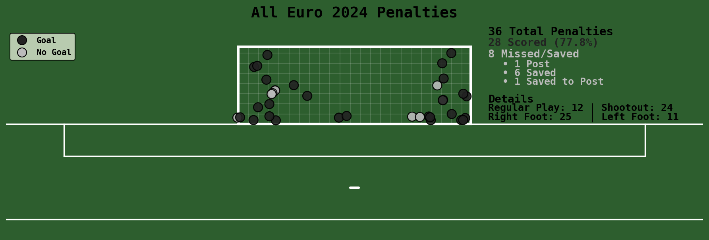
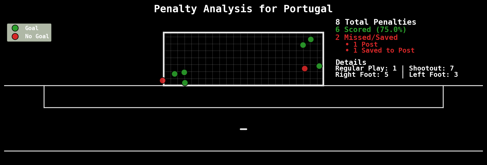
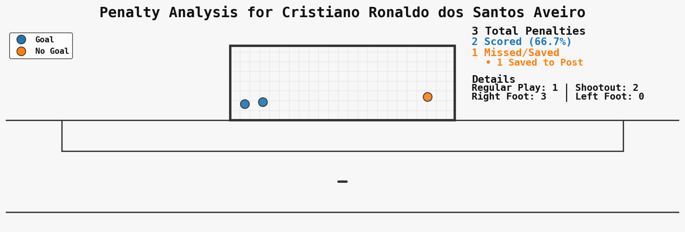

# Euro-2024-visualizations

Visualizations and analysis of penalty shots from UEFA Euro 2024 using StatsBomb event data.

## Features

- Visualize all penalties taken at Euro 2024, including shot placement and outcomes.
- Analyze penalties by player or by team.
- Customizable, publication-ready matplotlib visualizations.
- All data is loaded from a CSV file (no API calls required).

## Example Plots

Below are sample plots generated by the notebook:

### All Euro 2024 Penalties



### Penalties by Team



### Penalties by Player




> _To generate these images, run the notebook and save the figures to the `code/plots/` directory using `plt.savefig()` in your plotting code._

## Usage

1. **Prepare the data**  
   Export StatsBomb event data for Euro 2024 to a CSV file (e.g., `euro2024_shots.csv`).  

2. **Open the notebook**  
   Open `code/euro2024.ipynb` in Jupyter or VS Code.

3. **Run the notebook**  
   - The notebook will load the CSV and extract all shots and penalties.
   - Use the provided functions to plot:
     - All penalties in the tournament
     - Penalties by player
     - Penalties by team

4. **Example code**
   ```python
   # Plot all penalties
   plot_shot_locations(
       penalties,
       theme="green",
       palette="neutral",
       title="All Euro 2024 Penalties"
   )

   # Plot for a specific player
   plot_penalties_by_filter(
       penalties,
       player_name="Harry Kane",
       theme="green",
       palette="neutral"
   )

   # Plot for a specific team
   plot_penalties_by_filter(
       penalties,
       team_name="England",
       theme="green",
       palette="neutral"
   )
   ```

## Requirements

- Python 3.8+
- pandas
- matplotlib
- numpy

## Data

- The notebook expects a CSV file with StatsBomb event data for Euro 2024.
- If you use `statsbombpy`, you can export the data as follows:
  ```python
  events.to_csv('euro2024_events.csv', index=False, encoding='utf-8', quoting=1)
  ```

## License

MIT License

---